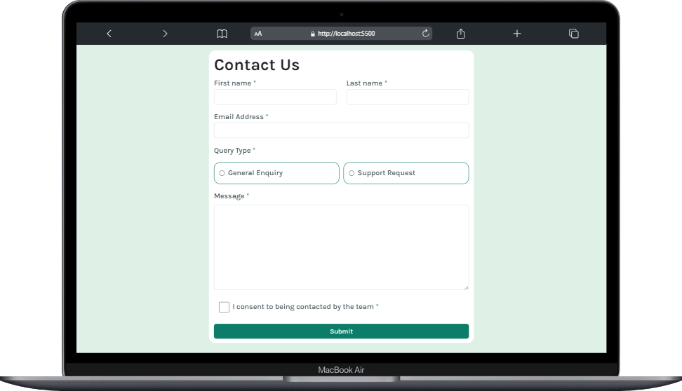

# Contact Us

**El proyecto consitio en crear un formulario de contacto y hacer que se parezca lo más posible al diseño que nos proporciono Frontend Mentor. Se trabajo en que este formulario sea lo mas accesible posible.**

## El usuario podra realizar
- **Completar el formulario y ver un mensaje de éxito tras el envío exitoso.**
- **Recibir mensajes de validación de formulario si:**
	- **Se ha perdido un campo obligatorio**
	- **La dirección de correo electrónico no tiene el formato correcto**

## Tecnologias:
- **HTML**
- **CSS**
- **JavaScript**

