## Protectos de Frontend Mentor

## Proyectos:

## Home page de Noticias
- [Link](https://Leonardo291024.github.io/Frontend_Mentor/00-home-page-noticias)

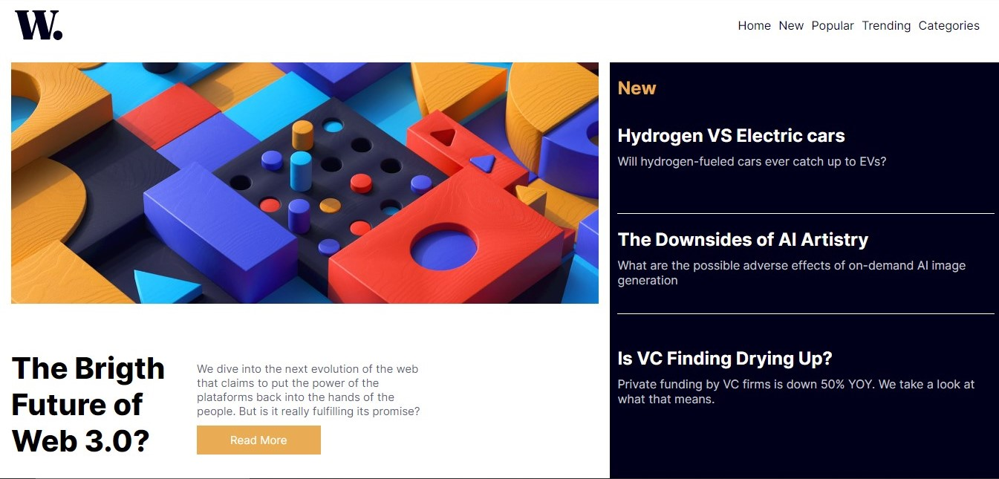

## Age Calculator
- [Link](https://Leonardo291024.github.io/Frontend_Mentor/01-age-calculator)

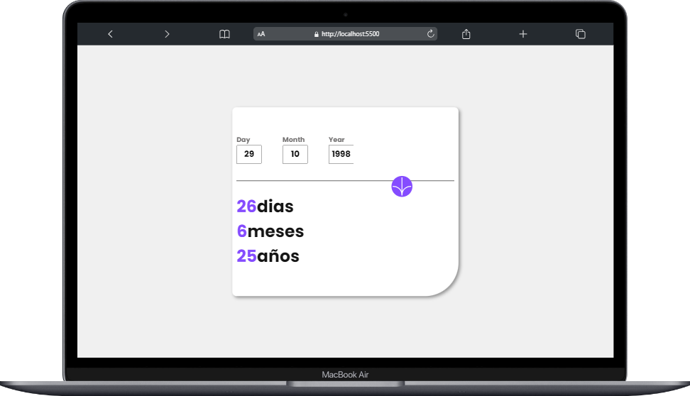

## Card Component
- [Link](https://Leonardo291024.github.io/Frontend_Mentor/02-card-component)

## Calculadora de Propinas
- [Link](https://Leonardo291024.github.io/Frontend_Mentor/03-calculadora-propinas)

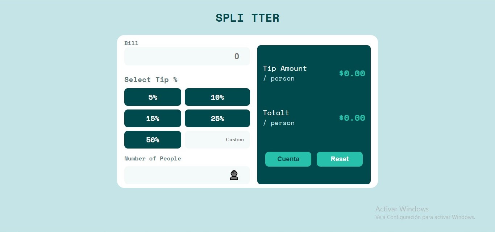

## Card Component
- [Link](https://Leonardo291024.github.io/Frontend_Mentor/04-card-component)

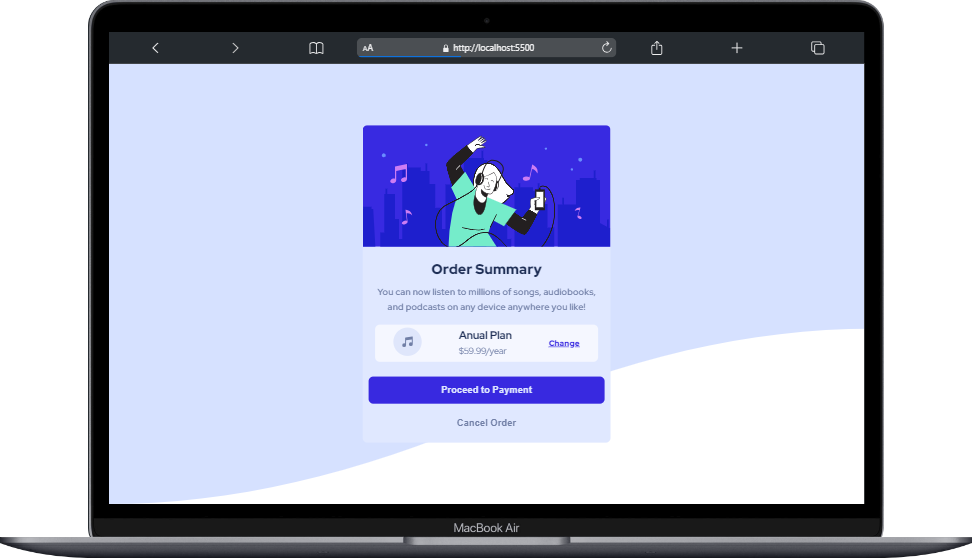

## Componente de 3 columnas
- [Link](https://Leonardo291024.github.io/Frontend_Mentor/05-component-3-colunmas)

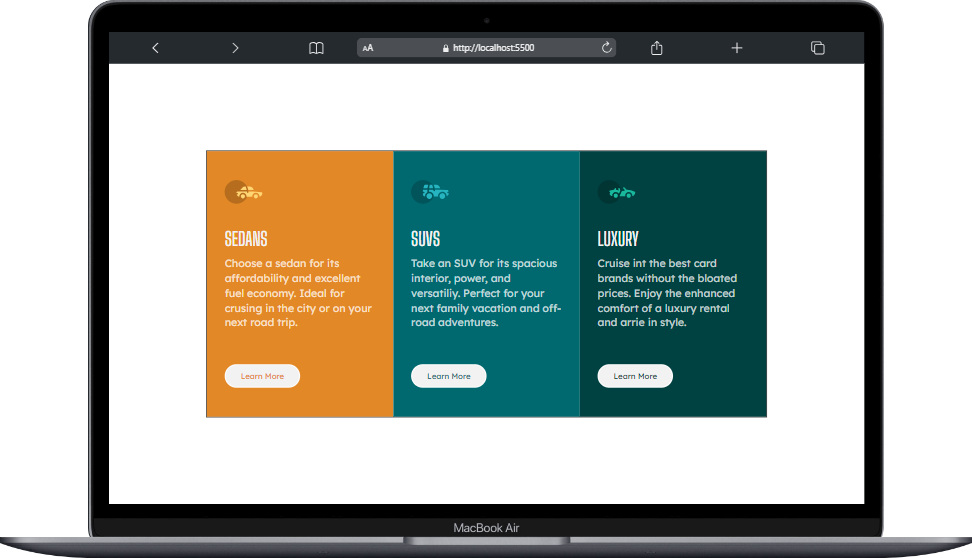

## Componente card calificativo
- [Link](https://Leonardo291024.github.io/Frontend_Mentor/06-component-card-calificativo)

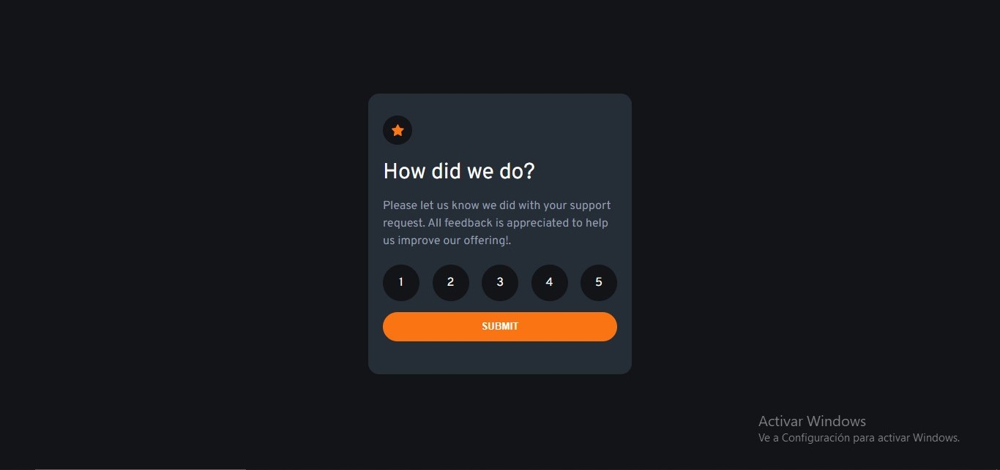

## Formulario de Subscripcion
- [Link](https://Leonardo291024.github.io/Frontend_Mentor/07-formulario-subscripcion)

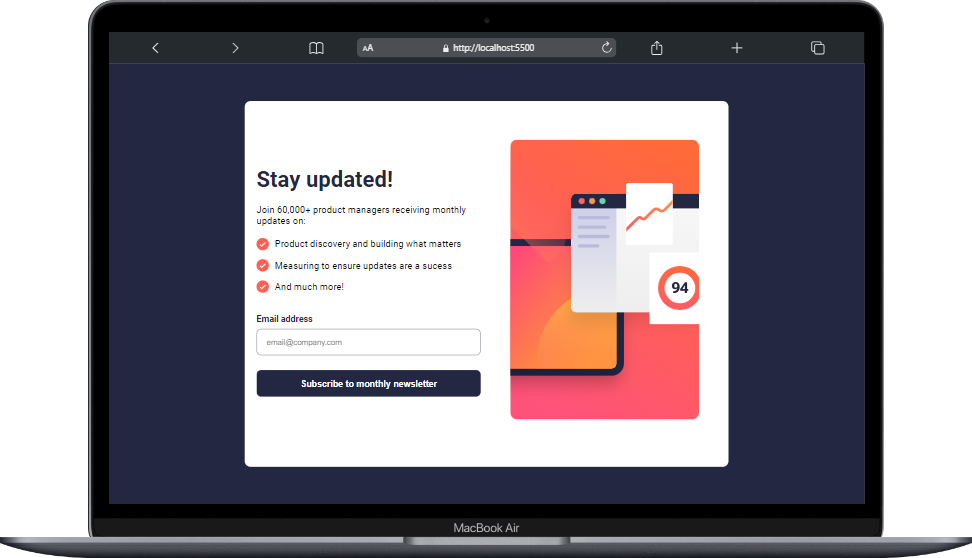

## Formulario de Subscripcion Ping
- [Link](https://Leonardo291024.github.io/Frontend_Mentor/08-formulario-ping)

## Componente Grid
- [Link](https://Leonardo291024.github.io/Frontend_Mentor/09-grid-component)

## Loops Studio
- [Link](https://Leonardo291024.github.io/Frontend_Mentor/10-loop-studios)

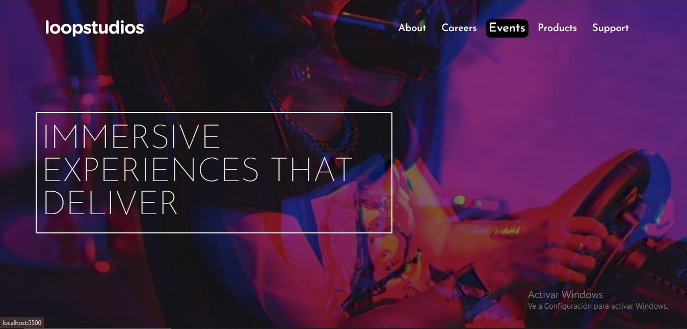

## NFT Card
- [Link](https://Leonardo291024.github.io/Frontend_Mentor/11-nft-card)

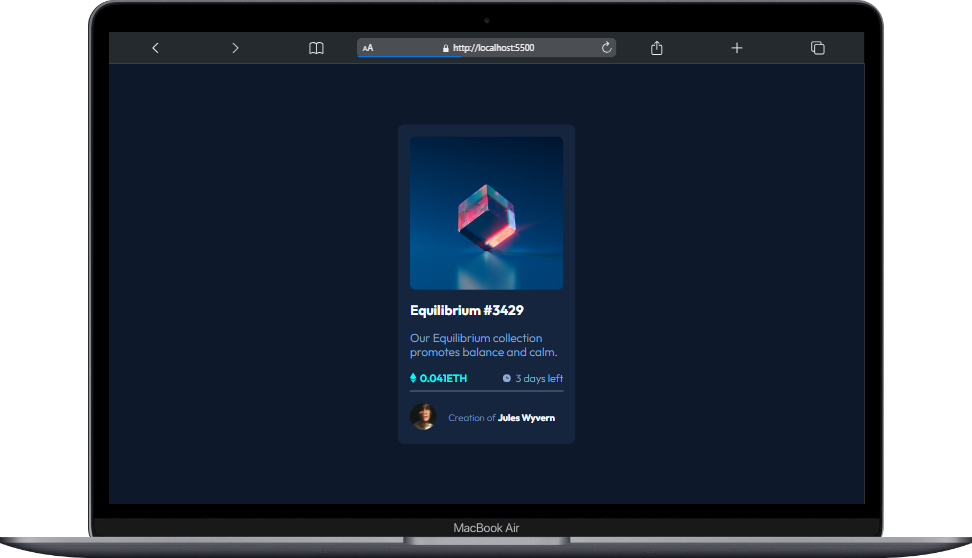

## Social Card
- [Link](https://Leonardo291024.github.io/Frontend_Mentor/12-card-redes-sociales)

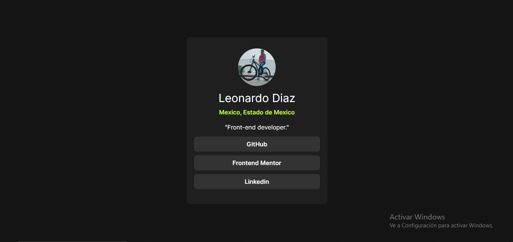

## Profile Card
- [Link](https://Leonardo291024.github.io/Frontend_Mentor/13-profile-card-component)

## Formulario Base Aparel
- [Link](https://Leonardo291024.github.io/Frontend_Mentor/14-formulario-base-aparel)

## Recetario
- [Link](https://Leonardo291024.github.io/Frontend_Mentor/15-recetario)

## Component Result Sumary
- [Link](https://Leonardo291024.github.io/Frontend_Mentor/16-result-sumary-component)

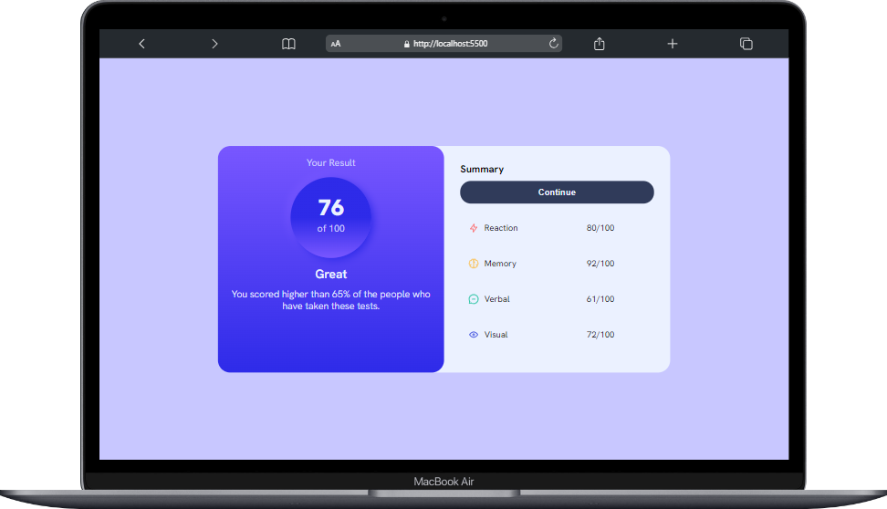

## Powered by Tecnology
- [Link](https://Leonardo291024.github.io/Frontend_Mentor/17-powered-by-tecnology)

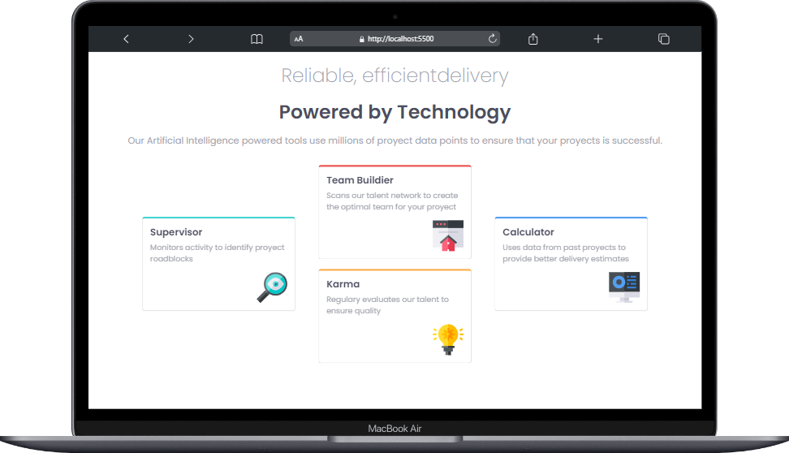

## Formulario de Registro
- [Link](https://Leonardo291024.github.io/Frontend_Mentor/18-formulario-reguistro)

