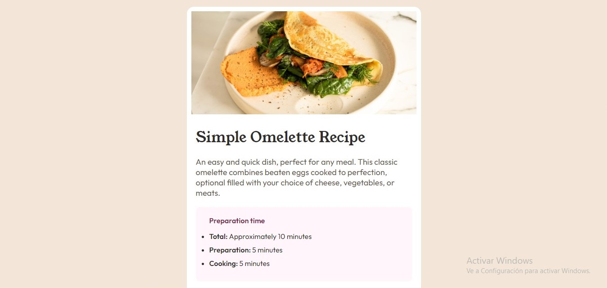

# Protectos de Frontend Mentor

**En este Repositorio encontraras algunas de las soluciones a los Retos de Frontend Mentor. Aqui eh aplicado conocimientos en HTML CSS y JavaScript.**
**Encontraras distintos Layouts tales como componentes sencillos como Cards o Landing Pages mas completas.**

**En mi sitio Web podras encontar los proyectos mas relevantes que eh echo para Frontend Mentor y otros que eh echo por mi cuenta.**

- **[Leo_Dev](https://leonardo291024.github.io/Leonardo__Diaz/index.html)**

## Proyectos:

### Home page de Noticias
- **[Sitio Web](https://Leonardo291024.github.io/Frontend_Mentor/00-home-page-noticias)**

- **[Repositorio](https://github.com/Leonardo291024/Frontend_Mentor/tree/main/00-home-page-noticias)**

### Age Calculator
- **[Sito Web](https://Leonardo291024.github.io/Frontend_Mentor/01-age-calculator)**

- **[Repositorio](https://github.com/Leonardo291024/Frontend_Mentor/tree/main/01-age-calculator)**

### Card Component
- **[Sitio Web](https://Leonardo291024.github.io/Frontend_Mentor/02-card-component)**

- **[Repositorio](https://github.com/Leonardo291024/Frontend_Mentor/tree/main/02-card-component)**

### Calculadora de Propinas
- **[Sito Web](https://Leonardo291024.github.io/Frontend_Mentor/03-calculadora-propinas)**

- **[Repositorio](https://github.com/Leonardo291024/Frontend_Mentor/tree/main/03-calculadora-propinas)**

### Card Component
- **[Sitio Web](https://Leonardo291024.github.io/Frontend_Mentor/04-card-component)**

- **[Repositorio](https://github.com/Leonardo291024/Frontend_Mentor/tree/main/04-card-component)**

### Componente de 3 columnas
- **[Sitio Web](https://Leonardo291024.github.io/Frontend_Mentor/05-component-3-colunmas)**

- **[Repositorio](https://github.com/Leonardo291024/Frontend_Mentor/tree/main/05-component-3-colunmas)**

### Componente card calificativo
- **[Sitio Web](https://Leonardo291024.github.io/Frontend_Mentor/06-component-card-calificativo)**

- **[Repositorio](https://github.com/Leonardo291024/Frontend_Mentor/tree/main/06-component-card-calificativo)**

### Formulario de Subscripcion
- **[Sitio Web](https://Leonardo291024.github.io/Frontend_Mentor/07-formulario-subscripcion)**

- **[Repositorio](https://github.com/Leonardo291024/Frontend_Mentor/tree/main/07-formulario-subscripcion)**

### Formulario de Subscripcion Ping
- **[Sitio Web](https://Leonardo291024.github.io/Frontend_Mentor/08-formulario-ping)**

- **[Repositorio](https://github.com/Leonardo291024/Frontend_Mentor/tree/main/08-formulario-ping)**

### Componente Grid
- **[Sitio Web](https://Leonardo291024.github.io/Frontend_Mentor/09-grid-component)**

- **[Repositorio](https://github.com/Leonardo291024/Frontend_Mentor/tree/main/09-grid-component)**

### Loops Studio
- **[Sitio Web](https://Leonardo291024.github.io/Frontend_Mentor/10-loop-studios)**

- **[Repositorio](https://github.com/Leonardo291024/Frontend_Mentor/tree/main/10-loop-studios)**

### NFT Card
- **[Sitio Web](https://Leonardo291024.github.io/Frontend_Mentor/11-nft-card)**

- **[Repositorio](https://github.com/Leonardo291024/Frontend_Mentor/tree/main/11-nft-card)**

### Social Card
- **[Sitio Web](https://Leonardo291024.github.io/Frontend_Mentor/12-card-redes-sociales)**

- **[Repositorio](https://github.com/Leonardo291024/Frontend_Mentor/tree/main/12-card-redes-sociales)**

### Profile Card
- **[Sitio Web](https://Leonardo291024.github.io/Frontend_Mentor/13-profile-card-component)**

- **[Repositorio](https://github.com/Leonardo291024/Frontend_Mentor/tree/main/13-profile-card-component)**

### Formulario Base Aparel
- **[Sitio Web](https://Leonardo291024.github.io/Frontend_Mentor/14-formulario-base-aparel)**

- **[Repositorio](https://github.com/Leonardo291024/Frontend_Mentor/tree/main/14-formulario-base-aparel)**

### Recetario
- **[Sitio Web](https://Leonardo291024.github.io/Frontend_Mentor/15-recetario)**

- **[Repositorio](https://github.com/Leonardo291024/Frontend_Mentor/tree/main/15-recetario)**

### Component Result Sumary
- **[Sitio Web](https://Leonardo291024.github.io/Frontend_Mentor/16-result-sumary-component)**

- **[Repositorio](https://github.com/Leonardo291024/Frontend_Mentor/tree/main/16-result-sumary-component)**

### Powered by Tecnology
- **[Sitio Web](https://Leonardo291024.github.io/Frontend_Mentor/17-powered-by-tecnology)**

- **[Repositorio](https://github.com/Leonardo291024/Frontend_Mentor/tree/main/17-powered-by-tecnology)**

### Formulario de Registro
- **[Sitio Web](https://Leonardo291024.github.io/Frontend_Mentor/18-formulario-reguistro)**

- **[Repositorio](https://github.com/Leonardo291024/Frontend_Mentor/tree/main/18-formulario-reguistro)**

### Social Seccion
- **[Sitio Web](https://Leonardo291024.github.io/Frontend_Mentor/19-social-proof-section)**

- **[Repositorio](https://github.com/Leonardo291024/Frontend_Mentor/tree/main/19-social-proof-section)**

### Tarjeta de Estadisticas
- **[Sitio Web](https://Leonardo291024.github.io/Frontend_Mentor/20-tarjeta-estadisticas)**

- **[Repositorio](https://github.com/Leonardo291024/Frontend_Mentor/tree/main/20-tarjeta-estadisticas)**

### Tarjeta de Producto
- **[Sitio Web](https://Leonardo291024.github.io/Frontend_Mentor/21-card-product)**

- **[Repositorio](https://github.com/Leonardo291024/Frontend_Mentor/tree/main/21-card-product)**

### Acordeon de preguntas
- **[Sitio Web](https://Leonardo291024.github.io/Frontend_Mentor/22-acordeon-preguntas)**

- **[Repositorio](https://github.com/Leonardo291024/Frontend_Mentor/tree/main/22-acordeon-preguntas)**

